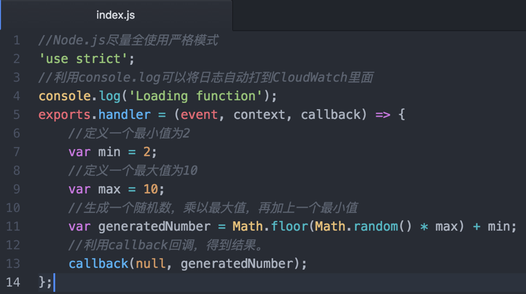
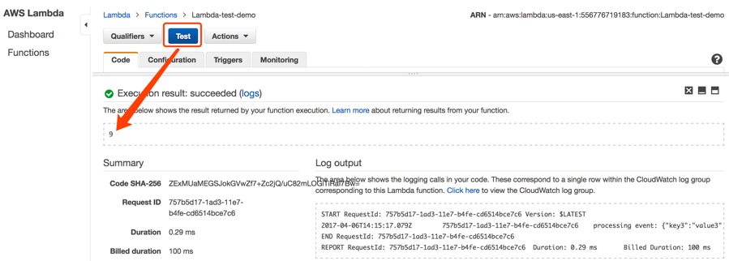
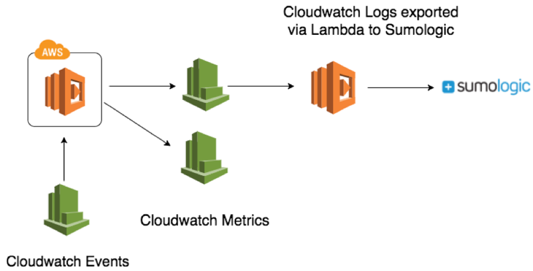

## **带您玩转Lambda，轻松构建Serverless后台【上篇】** 

## 目的

AWS CTO Werner Vogels曾经在AWS re:Invent大会上提到: 如果把云计算理解成一个执行环境，那么，在这个环境里，函数（即业务逻辑的载体）+数据（即跟业务相关的输入与输出）就是应用的核心，有了Functions、Data、Event这三者，其它任何代码和框架，无非是整个应用的胶水和UI罢了。那么，最理想的情况就是用最少的时间写胶水，将更多的时间投入到核心应用的开发中，甚至，彻底实现整个软件栈的微服务化。那么能不能做到呢？答案是肯定的。AWS Lambda也在这样的背景下应运而生了，其实在很多人眼里，Lambda是一个具有“革命性”的服务，我本人也非常喜欢Lambda这个服务，因为它给我的感觉是: 轻、快、高可用！能够快速将想法写成代码，并应用到生产，不需要关心底层基础设施的运维。接下来，让我们一起搭建一个serverless的后台！

## 1. AWS Lambda怎么用？

怎么学习Lambda呢？让我们从一个简单的数学问题开始，10以内乘法和加法运算，获得随机的一个数字。代码有注释，如下:



```javascript
//Node.js尽量全使用严格模式（Node.js 6.10）
'use strict';
//利用console.log可以将日志自动打到CloudWatch里面
console.log('Loading function');
exports.handler = (event, context, callback) => {
    //定义一个最小值为2
    var min = 2;
    //定义一个最大值为10
    var max = 10;
    //生成一个随机数，乘以最大值，再加上一个最小值
    var generatedNumber = Math.floor(Math.random() * max) + min;
    //利用callback回调，得到结果。
    callback(null, generatedNumber);
};
```

接下去，然后选择Lambda服务 


创建一个Lambda Function 


选择Node.js 6.10的环境 


当然，Lambda目前支持C#，Node.js，Python，Java，后续会支持很多的语言比如Go，PHP，Ruby等。换言之，之后任何能在Linux上跑的环境都能在Lambda上运行。 


接下去把上面那段代码拷贝进去，选择“Role”角色，这其实就是Lambda执行时所拥有的权限。当然，你可以通过IAM服务创建一个新的Role，或者选择已经存在的Role。 


然后点击“Create Function”，接着就会看到


好！Lambda创建成功了！在Lambda上方点击Test，进行测试，能看到输出的结果。细心的你已经发现，代码运行的时间只有0.3ms哦。


查看Lambda执行的结果:


您可以多次点击test，每次输出的结果都不一样，这是因为，代码一开始生成了一个随机数，所以每次输出的结果也都是随机的。



您可以点击“View logs in CloudWatch”，能看到所有Lambda运行相关的日志。AWS已经把这部分的日志已经自动集成到CloudWatch里面了。


如果你想结合自己常用的日志分析工具，比如sumologic，可以再用一个Lambda将CloudWatch Logs的日志导出。



## 2. Lambda + API Gateway

到这里，我们发现，应用的逻辑可以交给Lambda执行，那前端的HTTP请求怎么办呢？AWS还有一个服务叫API Gateway，提供的HTTP网关服务，那么，Lambda怎么和API Gateway又怎么结合起来使用呢？

接下去，您可以进入到API Gateway这个服务里面，点击“Create API”。


写入API的名字然后创建


创建一个Method


选择HTTP Get方法。目前，AW API Gateway支持HTTP DELETE, HEAD, OPTIONS, PATCH, POST, PUT等方法。指定我们之前创建的Lambda函数，选择“Integration Type”Lambda Function。


输入Lambda对应的Region和Lambda函数的名字，然后点击Save。


然后进行部署API，点击“Deploy API”。


指定API的版本，比如prod或者test。


注意，当你定义好这个API之后，可以自动生成整套SDK，有Android，JavaScript，iOS-OC，iOS-Swift，Java。所以，开发人员可以基于这一套自定义的、标准的SDK进行统一开发。只要指定了统一的后端数据库，所有的开发人员都可以各自开发自己的内容，互不干扰，最终形成一个统一、完整的项目。


然后点击“Stages”，查看Get的http地址。


将这个地址复制到浏览器（比如Firefox），可以查看Lambda运行后输出的结果。这样，Lambda就和API gateway结合起来了。


点击刷新，当然数字会变。


 

## 3. Lambda + API Gateway + 传参

如果客户端需要想传递参数，怎么办呢？

那就可以通过API Gateway接受客户端（比如浏览器）输入的参数，然后API Gateway把这个参数传递给后端的Lambda，Lambda通过event对象获得前端API Gateway传递过来的参数，从而进行代码的逻辑执行。

让我们先改动一下Lambda的代码，将固定值2和10换成以变量的形式传递进去。


然后再到API Gateway服务里面，找到“Integration Request”。


找到“Body Mapping Templates”，修改其中的“application/json”，输入提供的内容。


```json
{
    "min":$input.params('min'),
    "max":$input.params('max')
}
```

点击保存，这样，就通过客户端就可以把参数传递给API Gateway了。比如：

<https://j3bi4vs4w4.execute-api.us-west-2.amazonaws.com/prod/number> 

这个时候打开之前的链接是空值，因为还没传递参数进去。


<https://j3bi4vs4w4.execute-api.us-west-2.amazonaws.com/prod/number?min=1&max=10> 

在浏览器客户端中，传递参数进去之后，比如min=1，max=10，如下：


刷新浏览器，当然会得到随机的结果。


再来一次，刷新浏览器，当然会得到随机的结果。


 

## 4. 快速部署Lambda函数？

部署Lambda的函数，可以直接在控制台输入代码，也可以在本地写好之后打成zip包上传到Lambda，或者上传到S3再指定链接内部加载到Lambda上。

当然，如果觉得不是很方便，目前其实已经有很多开源的框架支持都Lambda的快速部署了，比如SERVERLESS.com，Claudiajs.com，APEX，Zappa，Kappa，Chalice等。


【注意！】我们会在下一期内容中专门讲解这些框架怎么用，以及如何借用这些框架，再配合AWS CodePipeline，CodeCommit，CodeBuild，CloudFormation完全实现serverless微服务化，一键自动化发布和部署整个软件栈。

 

在这里，由于个人喜好，我们拿一个比较轻量的工具APEX举例，<http://apex.run/>，Apex集成了Lambda的SDK，用户只需要在本地执行apex init命令就创建了一个Lambda环境以及所需的Role，然后通过deploy命令就可以将本地的Lambda代码以及所需要的依赖自动打成zip包，并上传到云端环境。并且Apex会自动进行Lambda版本管理，更重要的是，还支持回滚，查看云端log。这可以让您真正只关心代码，写完代码之后直接部署就可以了，非常方便。你会发现，开发的时候甚至连AWS的控制台都不需要打开！


本地安装，一条curl语句。搞定了！真的挺简单的。

curl <https://raw.githubusercontent.com/apex/apex/master/install.sh> | sudo sh 

接下去通过aws configure配置你的权限

```json
danrongm:~ danrong$ aws configure
AWS Access Key ID [****************2T5A]:
AWS Secret Access Key [****************Tcma]:
Default region name [us-west-2]:
Default output format [json]:
```

创建apex项目: apex init，然后输入项目名称first-apex-project


接着就开始部署了

```json
acbc32c13f31:apex-demo danrongm$ apex deploy 
   • creating function       env= function=hello 
   • created alias current   env= function=hello version=1 
   • function created        env= function=hello name=first-apex-project_hello version=1
```

Apex自动会帮您创建Role，以及进行版本的管理和控制。当你修改完代码之后，可以再次执行apex deploy，只要代码有改变，版本号以数字形式就会往上增加。 

如果部署其中的一个函数: apex deploy hello

如果调用函数显示输出结果: apex invoke hello 

另外，可以直接在本地查看日志的输出。

```json
apex-demo danrongm$ apex invoke -L hello 会把日志输出的所有内容输出
START RequestId: 7c432478-ee78-11e6-8d9b-21a4e48977b8 Version: 5
2017-02-09T03:33:13.014Z     7c432478-ee78-11e6-8d9b-21a4e48977b8     processing event: {}
END RequestId: 7c432478-ee78-11e6-8d9b-21a4e48977b8
REPORT RequestId: 7c432478-ee78-11e6-8d9b-21a4e48977b8     Duration: 0.41 ms     Billed Duration: 100 ms      Memory Size: 128 MBMax Memory Used: 10 MB 104
```

查看Apex的所有日志（其实就是最近5分钟内的CloudWatch的日志）

```json
apex logs
```

##  

## 5. Lambda + CloudWatch Event

有些场景，有可能是想定期、或者定时让Lambda去执行处理逻辑，针对这种情况，可以使用CloudWatch Event，触发Lambda定时执行。


可以在CloudWatch里面创建一个Rule，然后Event selector可以通过Cron方式定期调用Lambda函数，如下:


这样，你就可以按照一定的规则，定时的去触发Lambda函数了。更多内容可参考:

<http://docs.aws.amazon.com/zh_cn/AmazonCloudWatch/latest/events/RunLambdaSchedule.html> 

 

## 6. Lambda + DynamoDB –>数据写入到数据库

用户发送HTTP请求，交给API Gateway处理，业务逻辑交给Lambda处理，那如果动态的数据需要存储到数据库呢？AWS提供了NoSQL的数据库DynamoDB和关系型数据库RDS，这些都可以和Lambda配合使用。值得一提的是，Lambda可以和RDS一样，放在VPC内部，配置安全组。

那么，如何使用Lambda把处理后的数据存储在DynamoDB呢？Lambda又怎么和数据库进行交互呢？直接上代码。首先创建一个Lambda函数，比如命名为: [lambda_dynamodb_write](https://us-west-2.console.aws.amazon.com/lambda/home?region=us-west-2#/functions/lambda_dynamodb_read)，代码如下


```javascript
'use strict'; 
console.log('Loading function'); 
var AWS = require('aws-sdk'); 
var docClient = new AWS.DynamoDB.DocumentClient(); 
AWS.config.region = 'us-west-2’; 
exports.handler = function (event, context, callback){ 
     var params = { 
          Item: { 
               date: Date.now(), 
               message: "Danrong" 
          }, 
          TableName: 'lambda_dynamodb_write_read' 
     }; 
     docClient.put(params, function(err, data){ 
          if(err){ 
               callback(err, null); 
          }else{ 
               callback(null, data); 
          } 
     }); 
}; 
```

## 7. Lambda + DynamoDB –>数据从数据库读取

搞定了数据库的写入操作，Lambda又怎么读写数据库里的内容呢？直接上代码。

创建一个Lambda函数，比如命名为: [lambda_dynamodb_](https://us-west-2.console.aws.amazon.com/lambda/home?region=us-west-2#/functions/lambda_dynamodb_read)read，代码如下


```javascript
'use strict'; 
console.log('Loading function'); 
var AWS = require('aws-sdk'); 
var docClient = new AWS.DynamoDB.DocumentClient({region:'us-west-2'}); 
exports.handler = function(event, context, callback){ 
     var params = { 
          TableName: 'lambda_dynamodb_write_read', 
          Limit: 100 
     }; 
     docClient.scan(params, function(err,data){ 
          if(err){ 
               callback(err, null); 
          }else{ 
               callback(null, data); 
          } 
     }); 
}; 
```

对于数据库的修改和删除操作，同样可以轻松做到。到这里，Lambda和DynamoDB的交互就搞定了。

## 8. Lambda + API Gateway + DynamoDB

此时，我们再将前面三者，即Lambda，API Gateway，DynamoDB结合起来。创建一个Date为主键的DynamoDB Table，让它存储Lambda处理的结果，如下：


由于之前我们已经创建过HTTP GET了，同样的方式，在API Gateway里面，创建一个HTTP POST的方法。如下:


API Gateway中可以解决跨域CORS的问题，点击“Enable CORS”。


到这里，客户端浏览器发出请求，会发送到API Gateway 那边，然后API Gateway传递客户端的参数给Lambda，Lambda通过Event对象获取API Gateway传参的值，并处理逻辑。比如将数据写入到DynamoDB，或者从DynamoDB读取数据显示在前端。

 

## 9. Lambda + API Gateway + DynamoDB + S3 + CloudFront

托管静态网站。如果您是一个网站，或者是移动、IoT等后台，可以把前端显示的静态内容，比如HTML，JS，CSS，以及所有图片托管在S3上，启用静态网站托管。

到这里，一个serverless的网站就做好了，您可以点击下面链接进行尝试。

<https://s3.amazonaws.com/danrong.io/index-ajax.html> 

 


前端显示的HTML代码开源，您可以公开下载:

<https://s3.cn-north-1.amazonaws.com.cn/danrong-share/external/aws-china-blog-lambda-demo-index.html> 

接下去，其实就是前端的UI设计了，比如，我比较喜欢用<http://www.bootcss.com/> 

完全可以改善一下前端的展示风格，看起来舒服一点。


如果要解决域名的问题，可以使用Amazon Route53访问（注意，域名也可以直接在Route53上购买），这样，就可以用您自定义的域名访问一个Serverless的网址了。


到这里，一个类似于**“点击发布评论”**、**“查看所有评论”**的网站就完成了。整个网站基于微服务的思想，完全实现了serverless的架构。

## 10. Lambda + CodeCommit + CodePipeline + CodeBuild + CloudFormation

到这里，或许您已经在考虑Lambda如何做到持续化的发布和部署呢？能不能让我的开发人员只关心写代码，其余之后的事情全部一键搞定呢？比如，开发人员在本地用各种各样的IDE写代码，写完之后将代码提交到Git仓库，然后整个pipeline自动完成。在AWS的世界里，当然可以！例如，整个流程可以这样:


我们完全可以利用AWS全面的开发工具，CodeCommit + CodePipeline + CodeBuild + CloudFormation，实现从代码开发，到代码提交，到代码发布，到代码构建，到代码部署，一键自动化发布整个软件栈。再配合Serverless的各种框架（见前面正文），真正可以做到微服务化并且快速迭代敏捷开发！

另外，读者也可以关心一下Security安全的问题，比如Authentication, Authorization, Sensitive data等问题；关于Quality，比如Testing, Continuous Integration, Deployment等问题。这两部分的内容，我们将会在下一期中介绍，期待您继续关注AWS中国官方微信。

https://aws.amazon.com/cn/blogs/china/lambda-serverless/

更多关于Lambda内容可以参考:

<https://aws.amazon.com/cn/lambda/>

<http://docs.aws.amazon.com/zh_cn/lambda/latest/dg/welcome.html> 


